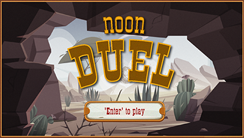

# Noon Duel

## Two players shooter game - Test your reflexes
 

### C++ totally made game developed with [EasySDL - Game framework](https://github.com/Luca71/EasySDL), my own game framework based on SDL2 library.
 

How to play:
- As soon as the counter reaches zero you have to shoot down your adversary, but only when the text label on bottom of the screen says "Shoot", otherwise you failed.
- If you shoot down your adversary, you earns one point.
- If you failed two consecutive times in the same match, you lose 1 point.
- The first player that reach 5 points wins the game.
  

Try the game:
- download the compiled version [NoonDuel Game](Compiled/NoonDuel.zip)
- Unzip in desktop and run NoonDuel.exe
